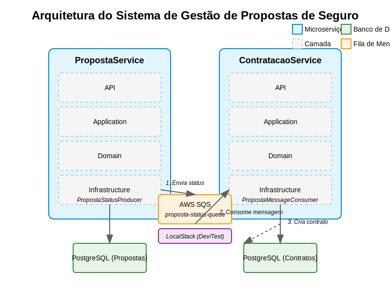

# Sistema de Gestão de Propostas de Seguro

Este projeto implementa um sistema de gestão de propostas de seguro utilizando arquitetura hexagonal e microserviços em .NET 9.0.

## Arquitetura

O sistema é composto por dois microserviços:

1. **PropostaService**: Responsável pelo gerenciamento de propostas de seguro.
2. **ContratacaoService**: Responsável pela criação e gerenciamento de contratos a partir de propostas aprovadas.

Cada microserviço segue a arquitetura hexagonal (ports and adapters) com as seguintes camadas:

- **Domain**: Contém as entidades de domínio, interfaces de repositórios e serviços.
- **Application**: Implementa os casos de uso da aplicação.
- **Infrastructure**: Contém implementações concretas de repositórios, acesso a banco de dados e serviços externos.
- **Api**: Expõe os endpoints REST para acesso às funcionalidades do sistema.

A comunicação entre os microserviços é realizada de forma assíncrona através do AWS SQS, conforme ilustrado no diagrama de arquitetura abaixo:



O diagrama mostra o fluxo de mensagens entre o PropostaService e o ContratacaoService, utilizando o AWS SQS como intermediário, com suporte ao LocalStack para desenvolvimento e testes.

## Tecnologias Utilizadas

- .NET 9.0
- Entity Framework Core
- PostgreSQL
- LocalStack para emulação de serviços AWS
- AWS SQS para comunicação assíncrona entre microserviços
- Swagger para documentação da API
- EntityFrameworkCore.InMemory para testes unitários

## Pré-requisitos

- .NET 9.0 SDK
- Docker e Docker Compose
- PostgreSQL
- LocalStack

## Configuração e Execução

### Opção 1: Usando Docker Compose (Recomendado)

```bash
# Iniciar todos os serviços com Docker Compose
docker-compose up -d
```

Esta opção inicia automaticamente:
- PostgreSQL com os bancos de dados necessários
- LocalStack com a fila SQS configurada
- PropostaService na porta 5001
- ContratacaoService na porta 5002

Os bancos de dados e tabelas são criados automaticamente durante a inicialização dos serviços.

### Opção 2: Execução Manual

#### 1. Configuração do Banco de Dados

```bash
# Criar os bancos de dados no PostgreSQL
docker run --name postgres -e POSTGRES_PASSWORD=postgres -p 5432:5432 -d postgres

# Conectar ao PostgreSQL e criar os bancos de dados
docker exec -it postgres psql -U postgres -c "CREATE DATABASE proposta_db;"
docker exec -it postgres psql -U postgres -c "CREATE DATABASE contratacao_db;"
```

#### 2. Configuração do LocalStack

```bash
# Iniciar o LocalStack
docker run --name localstack -p 4566:4566 -d localstack/localstack

# Criar a fila SQS
docker exec -it localstack awslocal sqs create-queue --queue-name proposta-status-queue
```

#### 3. Executar os Microserviços

```bash
# Executar o PropostaService
cd PropostaService/Api
dotnet run

# Em outro terminal, executar o ContratacaoService
cd ContratacaoService/Api
dotnet run
```

As migrações do banco de dados serão aplicadas automaticamente na inicialização dos serviços.

## Documentação da API com Swagger

O sistema utiliza Swagger/OpenAPI para documentação interativa das APIs. Após iniciar os serviços, você pode acessar a documentação Swagger através dos seguintes URLs:

### Quando executado via Docker Compose (Opção 1):

- **PropostaService Swagger UI**: http://localhost:5001/swagger
- **ContratacaoService Swagger UI**: http://localhost:5002/swagger

### Quando executado manualmente (Opção 2):

- **PropostaService Swagger UI**: http://localhost:5145/swagger
- **ContratacaoService Swagger UI**: http://localhost:5270/swagger

A interface do Swagger permite:

- Visualizar todos os endpoints disponíveis
- Testar as APIs diretamente pelo navegador
- Explorar os modelos de dados utilizados nas requisições e respostas
- Entender os possíveis códigos de status HTTP retornados por cada endpoint
- Verificar os modelos de dados e parâmetros necessários
- Entender as respostas esperadas e códigos de status HTTP

Para utilizar o Swagger UI:

1. Acesse a URL do Swagger do serviço desejado
2. Expanda o endpoint que deseja testar
3. Clique em "Try it out"
4. Preencha os parâmetros necessários
5. Clique em "Execute" para enviar a requisição

## Fluxo de Funcionamento

1. Uma proposta de seguro é criada através da API do PropostaService.
2. A proposta é analisada e seu status é atualizado (Aprovada ou Rejeitada).
3. Quando uma proposta é aprovada, o PropostaService envia uma mensagem para a fila SQS através do `PropostaStatusProducer`.
4. O ContratacaoService consome a mensagem da fila através do `PropostaMessageConsumer` e cria automaticamente um contrato para a proposta aprovada.
5. O contrato pode ser consultado e gerenciado através da API do ContratacaoService.

## Integração entre Serviços

A comunicação entre o PropostaService e o ContratacaoService é realizada de forma assíncrona através do AWS SQS:

1. **Produção de Mensagens**: Quando uma proposta é aprovada, o PropostaService utiliza o `PropostaStatusProducer` para enviar uma mensagem para a fila SQS `proposta-status-queue`.

2. **Consumo de Mensagens**: O ContratacaoService utiliza o `PropostaMessageConsumer` (implementado como um `BackgroundService`) para consumir mensagens da fila SQS e processar automaticamente a criação de contratos.

3. **Configuração do LocalStack**: Para desenvolvimento e testes, o sistema utiliza o LocalStack para emular o serviço AWS SQS. A configuração é feita automaticamente durante a inicialização dos serviços, verificando a configuração `LocalStack:UseLocalStack` nos arquivos `appsettings.json`.

4. **Formato das Mensagens**: As mensagens trocadas entre os serviços contêm informações como `PropostaId`, `Status`, `Nome`, `CPF` e `ValorSeguro`, permitindo a criação automática de contratos sem necessidade de consultas adicionais.

## APIs

### PropostaService

- `GET /api/propostas`: Lista todas as propostas
- `GET /api/propostas/{id}`: Obtém uma proposta específica
- `GET /api/propostas/status/{status}`: Lista propostas por status
- `POST /api/propostas`: Cria uma nova proposta
- `PUT /api/propostas/status`: Atualiza o status de uma proposta

### ContratacaoService

- `GET /api/contratos`: Lista todos os contratos
- `GET /api/contratos/{id}`: Obtém um contrato específico
- `GET /api/contratos/proposta/{propostaId}`: Obtém um contrato por ID da proposta
- `GET /api/contratos/cpf/{cpf}`: Lista contratos ativos por CPF
- `POST /api/contratos`: Cria um novo contrato manualmente
- `PUT /api/contratos/{id}/cancelar`: Cancela um contrato existente

## Testes com Postman

Para facilitar o teste das APIs, foi criada uma coleção Postman com todos os endpoints disponíveis. A coleção inclui:

- Requisições para todos os endpoints de ambos os serviços
- Variáveis de ambiente configuradas
- Scripts para testes automatizados
- Fluxo de teste completo (criação de proposta → aprovação → criação de contrato)

Para mais detalhes sobre como utilizar a coleção Postman, consulte o [Guia de Testes com Postman](postman_readme.md).

## Princípios de Design

Este projeto segue os princípios:

- **Clean Code**: Código limpo e legível
- **SOLID**: Princípios de design orientado a objetos
- **DDD (Domain-Driven Design)**: Foco no domínio do negócio
- **Arquitetura Hexagonal**: Separação clara entre domínio e infraestrutura

## Testes Unitários

O projeto utiliza testes unitários para garantir a qualidade do código e o funcionamento correto das funcionalidades:

- **EntityFrameworkCore.InMemory**: Utilizado para testes de repositórios, substituindo o SQLite em memória
- Testes de unidade para cada camada da aplicação (Domain, Application, Infrastructure, Api)
- Mocks para isolamento de dependências externas
- Testes de integração para validar o fluxo completo entre os serviços

## Testes BDD (Behavior-Driven Development)

O projeto também utiliza testes BDD para documentar e validar os comportamentos esperados do sistema do ponto de vista do negócio:

- Cenários escritos em formato Gherkin (Given-When-Then)
- Documentação viva dos requisitos e comportamentos esperados
- Facilita a comunicação entre equipes técnicas e de negócio

Para mais detalhes sobre os cenários BDD implementados, consulte o arquivo [BDD-README.md](./BDD-README.md).
